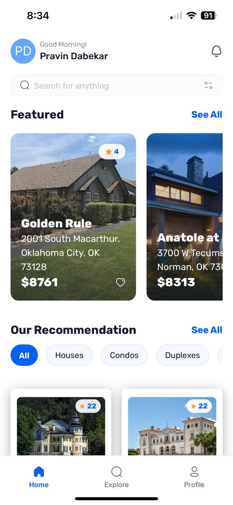
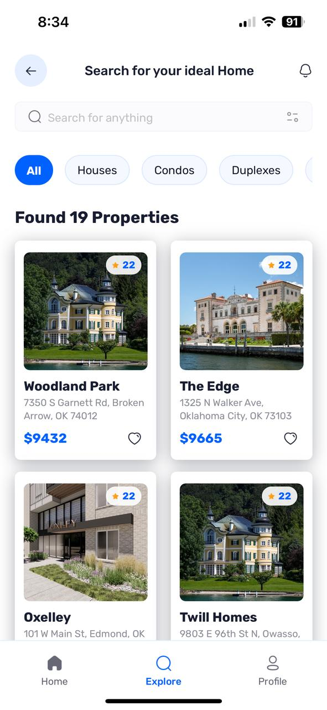
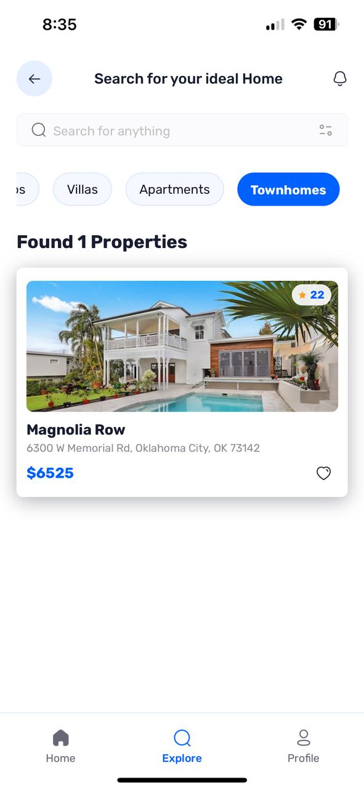
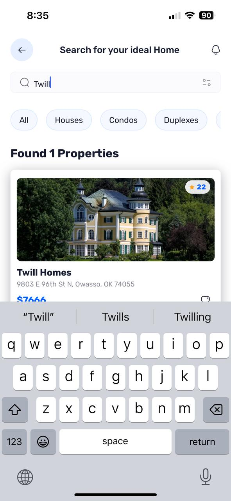
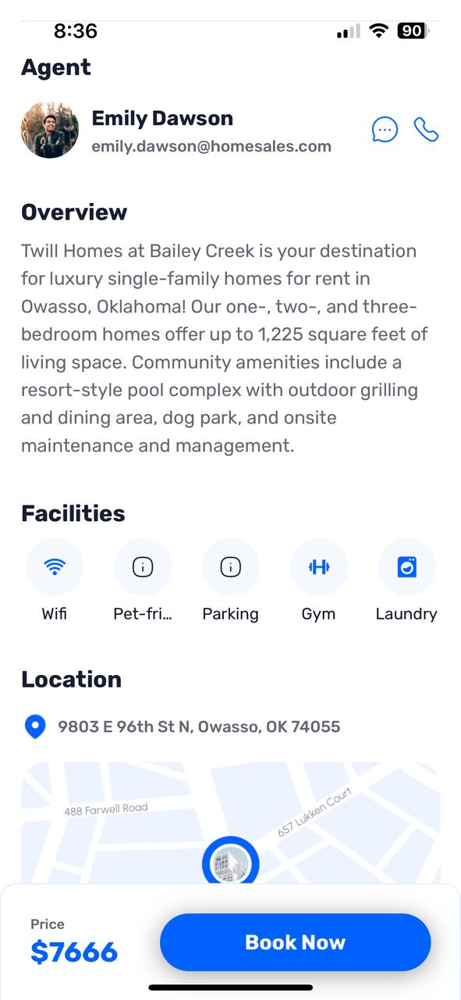
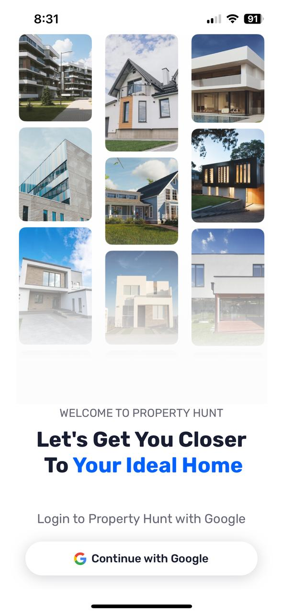

## 📌 **Property Hunt - A Full-Stack Real Estate App** 🏡  

Property Hunt is a modern, full-stack real estate app built with **Expo** and **TypeScript**, featuring authentication, a dynamic UI, and seamless backend integration with **Appwrite**.  

### ✨ **Features**
✅ **Google Authentication** with Appwrite  
✅ **Dynamic Routing** with Expo Router  
✅ **Modern UI** powered by **Tailwind CSS**  
✅ **Database & Storage** with **Appwrite**  
✅ **Property Search & Listings**  
✅ **Optimized Performance** with TypeScript  

---

## 🚀 **Tech Stack & Tools**
| **Technology**  | **Usage** |
|----------------|----------|
| **Expo** | React Native framework for mobile development |
| **React Native** | UI development for Android & iOS |
| **TypeScript** | Type safety and improved development experience |
| **Appwrite** | Backend for authentication, database, and storage |
| **Google Authentication** | Secure login |
| **Expo Router** | File-based routing for navigation |
| **Tailwind CSS** | Modern styling with utility-first approach |

---

## 📸 **App Screenshots**  

### **🏡 Home & Listings**
   

### **🔎 Search & Filters**
 
  

### **📍 Property Details**
 

### **🔐 Authentication & Login**
    

---

## 🛠 **Getting Started**
### **1⃣ Clone the Repository**
```sh
git clone https://github.com/Prince712/PropertyHunt.git
cd PropertyHunt
```

### **2⃣ Install Dependencies**
```sh
npm install
```

### **3⃣ Configure Appwrite**
Create a **`.env.local`** file and add your **Appwrite API keys**:
```sh
EXPO_PUBLIC_APPWRITE_PROJECT_ID
EXPO_PUBLIC_APPWRITE_ENDPOINT =https://cloud.appwrite.io/v1
EXPO_PUBLIC_APPWRITE_DATABASE_ID 
EXPO_PUBLIC_APPWRITE_AGENTS_COLLECTION_ID 
EXPO_PUBLIC_APPWRITE_GALLARIES_COLLECTION_ID 
EXPO_PUBLIC_APPWRITE_REVIEWS_COLLECTION_ID 
EXPO_PUBLIC_APPWRITE_PROPERTIES_COLLECTION_ID
```

### **4⃣ Run the App**
```sh
npx expo start
```
Scan the QR code to run the app on your device using **Expo Go** or an emulator.

---

## 🎉 **Contributing**
1. **Fork** the repository  
2. Create a **new branch** (`feature/my-feature`)  
3. **Commit** your changes (`git commit -m "Added new feature"`)  
4. **Push** to your branch (`git push origin feature/my-feature`)  
5. Create a **Pull Request** 🚀  

---

## 🔗 **Connect with Me**
📧 Email: [prince.dabekar7@gmail.com](mailto:prince.dabekar7@gmail.com)  
📎 LinkedIn: [Pravin Dabekar](https://www.linkedin.com/in/pravin-dabekar-467b98b2/)   

---

