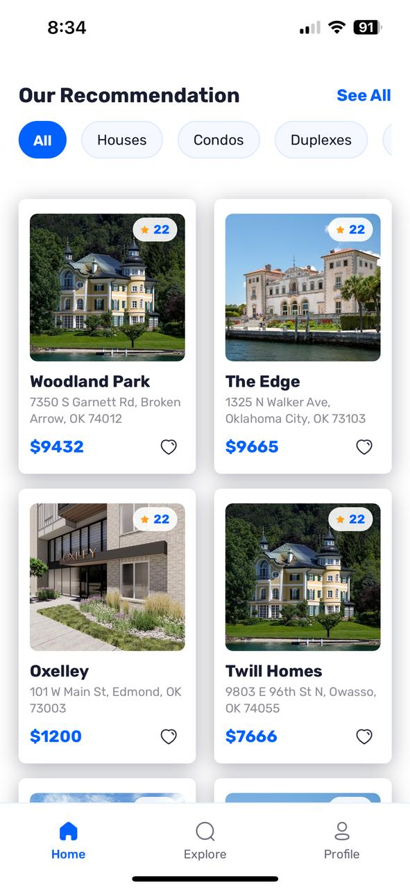
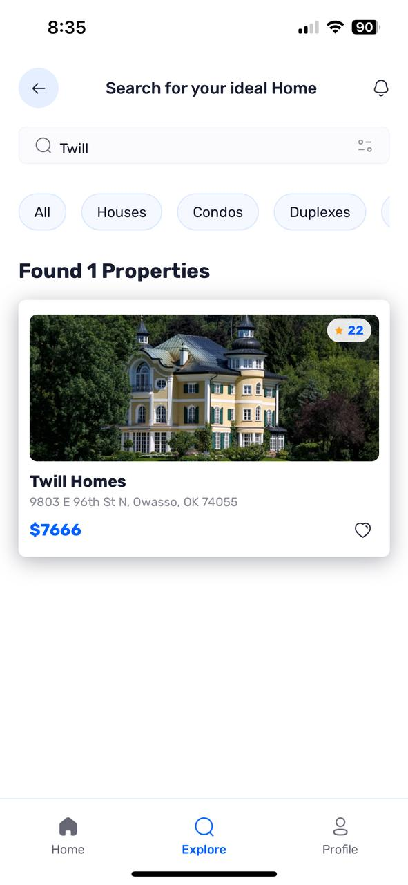

## 📌 **Property Hunt - A Full-Stack Real Estate App** 🏡 

Property Hunt is a modern, full-stack real estate app built with **Expo** and **TypeScript**, featuring authentication, a dynamic UI, and seamless backend integration with **Appwrite**.  

### ✨ **Features**
✅ **Google Authentication** with Appwrite  
✅ **Dynamic Routing** with Expo Router  
✅ **Modern UI** powered by **Tailwind CSS**  
✅ **Database & Storage** with **Appwrite**  
✅ **Property Search & Listings**  
✅ **Optimized Performance** with TypeScript  

---

## 🚀 **Tech Stack & Tools**
| **Technology**  | **Usage** |
|----------------|----------|
| **Expo** | React Native framework for mobile development |
| **React Native** | UI development for Android & iOS |
| **TypeScript** | Type safety and improved development experience |
| **Appwrite** | Backend for authentication, database, and storage |
| **Google Authentication** | Secure login |
| **Expo Router** | File-based routing for navigation |
| **Tailwind CSS** | Modern styling with utility-first approach |

---

## 📸 **App Screenshots**  

### **🏡 Home & Listings**
   

### **🔎 Search & Filters**
   

### **📍 Property Details**
   

### **🛒 Favorites & Profile**
   

### **🔐 Authentication & Login**
   

---

## 🛠 **Getting Started**
### **1⃣ Clone the Repository**
```sh
git clone https://github.com/your-username/property-hunt.git
cd property-hunt
```

### **2⃣ Install Dependencies**
```sh
npm install
```

### **3⃣ Configure Appwrite**
Create a **`.env`** file and add your **Appwrite API keys**:
```sh
APPWRITE_ENDPOINT=your-appwrite-url
APPWRITE_PROJECT_ID=your-project-id
APPWRITE_DATABASE_ID=your-database-id
APPWRITE_COLLECTION_ID=your-collection-id
```

### **4⃣ Run the App**
```sh
npx expo start
```
Scan the QR code to run the app on your device using **Expo Go** or an emulator.

---

## 💪 **Project Structure**
```
📂 property-hunt
 └▷ app
   ├▷ screens  # All app screens
   ├▷ components  # Reusable UI components
   ├▷ assets/images  # App images & icons
   ├▷ services  # API and backend logic (Appwrite)
   ├▷ tailwind.config.js  # Tailwind CSS config
   └▷ tsconfig.json  # TypeScript config
```

---

## 🎯 **Future Enhancements**
- 🌟 **Dark Mode** support  
- 📍 **Map Integration** for property locations  
- 🏡 **User Listings** (Post & Sell Properties)  
- 🔔 **Push Notifications**  

---

## 🎉 **Contributing**
1. **Fork** the repository  
2. Create a **new branch** (`feature/my-feature`)  
3. **Commit** your changes (`git commit -m "Added new feature"`)  
4. **Push** to your branch (`git push origin feature/my-feature`)  
5. Create a **Pull Request** 🚀  

---

## 🔗 **Connect with Me**
📧 Email: [prince.dabekar7@gmail.com](mailto:prince.dabekar7@gmail.com)  
📎 LinkedIn: [Your LinkedIn Profile](https://linkedin.com/in/yourprofile)  
🌍 Portfolio: [your-portfolio.com](https://your-portfolio.com)  

---

